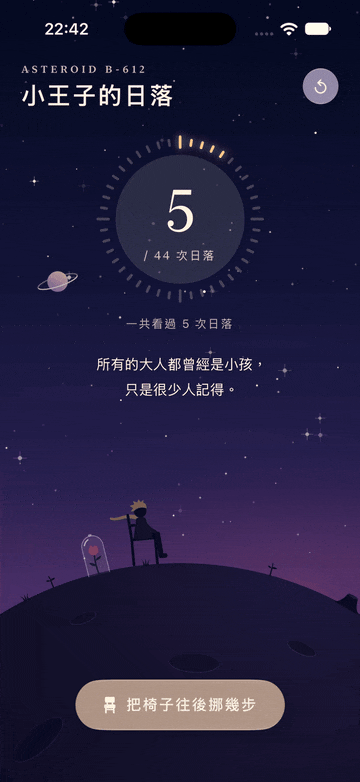
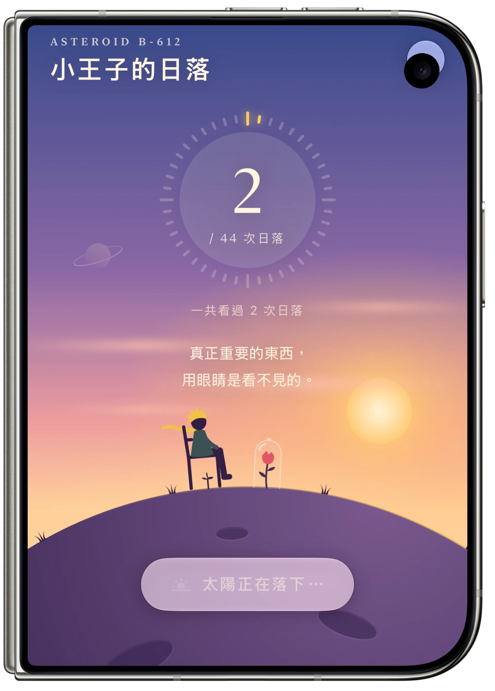
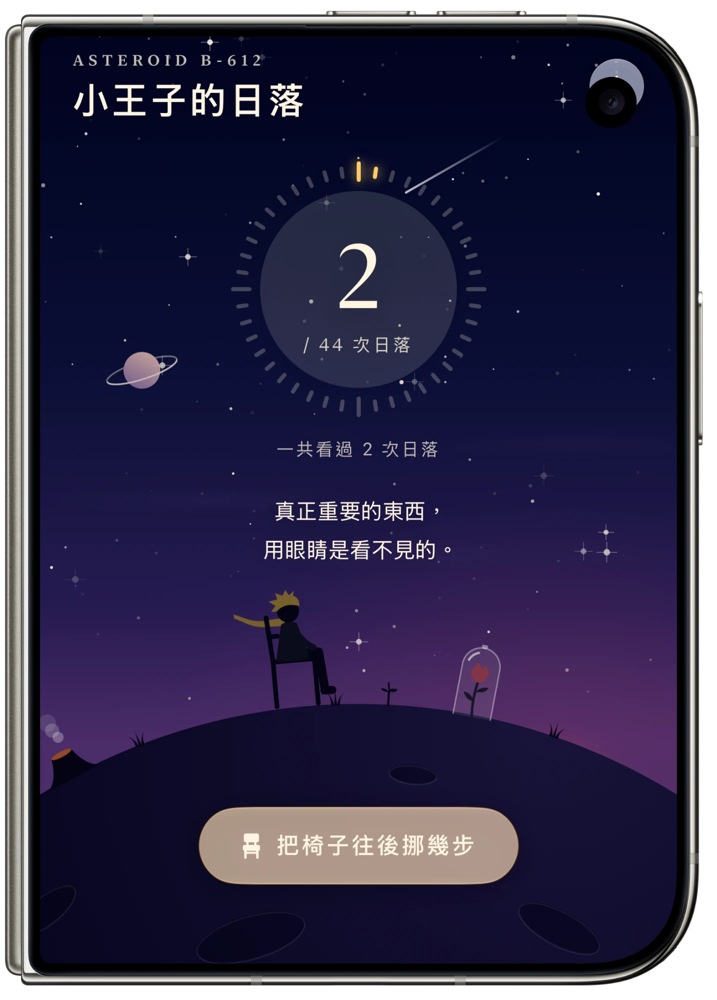

<div align="center">

# 🌅 B612 Sunset Count

**A tiny SwiftUI love letter to *The Little Prince*: watch the sun set over Asteroid B-612, again and again.**

[](https://swift.org)
[](https://developer.apple.com/xcode/swiftui/)
[](https://developer.apple.com/ios/)
[](https://developer.apple.com/macos/)
[](https://developer.apple.com/visionos/)
[](https://developer.apple.com/xcode/)
[](#-how-its-drawn)



*🪑 Move the chair, watch the sun set again · 挪一挪椅子，再看一次日落*

[🇺🇸 English](#english) · [🇹🇼 繁體中文](#chinese)

<table>
  <tr>
    <td align="center"></td>
    <td align="center"></td>
  </tr>
  <tr>
    <td align="center">🌇 Golden hour · 黃昏</td>
    <td align="center">🌌 Starry night · 星夜</td>
  </tr>
</table>

</div>

---

<a id="english"></a>

## 🇺🇸 English

> *"One day, I saw the sun set forty-four times!"* (The Little Prince)

On a planet as small as B-612, you only need to move your chair a few steps to watch another sunset. This app lets you do exactly that and counts every sunset you watch today.

### ✨ Features

- 🌅 **Living sky**: the gradient slowly shifts from golden hour to rose-violet dusk to a deep starry night.
- ☀️ **A real sunset**: the sun sinks behind the curve of the asteroid, and its warm glow fades with it.
- ⭐ **Twinkling stars & shooting stars**: the stars fade in as night falls, and a shooting star crosses the sky every few seconds.
- 🤴 **The Little Prince on his chair**: his golden hair and yellow scarf flutter in the wind.
- 🌹 **His rose under a glass dome**, plus smoking volcanoes, an extinct volcano and baobab sprouts.
- 🪑 **Move the chair**: each move turns the planet by 1/44 of a full rotation, so after 44 sunsets the prince has travelled all the way around B-612.
- 🔆 **44-tick counter ring**: each sunset lights one golden tick.
- 💬 **Gentle quotes** inspired by the book, a new one after each sunset, with special lines for the 44th sunset and beyond.
- 📅 **Today & lifetime counts**: today's count resets at midnight, and the lifetime total is kept (stored with `@AppStorage`).
- 🫧 **Liquid Glass** buttons and haptic feedback when a sunset completes.

### 🎨 How it's drawn

There are **zero image assets**. Everything is drawn in SwiftUI code:

| File | What it does |
| --- | --- |
| `ContentView.swift` | Main screen, counter ring, quotes, sunset flow and persistence |
| `SkyScene.swift` | An `Animatable` scene: sky gradient, sun, clouds, stars and the rotating planet |
| `PlanetProps.swift` | `Canvas` illustrations: the prince, rose, volcanoes, baobabs and grass |
| `Palette.swift` | Color keyframes that interpolate with the sunset progress |

A single `progress` value (0 = golden hour, 1 = starry night) drives every color, the sun's position and the star opacity. A `rotation` value turns the planet surface each time the chair moves.

### 🚀 Getting Started

1. Clone the repo:
   ```bash
   git clone https://github.com/PeterPanSwift/B612SunsetCount.git
   ```
2. Open `B612SunsetCount.xcodeproj` in **Xcode 27** or later.
3. Pick an iPhone simulator (or your Mac) and press **⌘R**.
4. Tap **"看一次日落" (Watch a sunset)** and enjoy. 🌅

### 📋 Requirements

- Xcode 27+
- iOS 27+ / iPadOS 27+ / macOS 27+ / visionOS 27+

<p align="right"><a href="#chinese">🇹🇼 切換到中文 ↓</a></p>

---

<a id="chinese"></a>

## 🇹🇼 繁體中文

> *「有一天，我看了四十四次日落！」*（《小王子》）

在 B-612 這麼小的星球上，只要把椅子往後挪幾步，就能再看一次黃昏。這個 App 讓你陪小王子一次又一次地看日落，並記下今天看了幾次。

### ✨ 功能特色

- 🌅 **會變色的天空**：從金色黃昏，慢慢轉成玫瑰紫，最後變成深藍星夜。
- ☀️ **真的會落下的太陽**：太陽沉到小行星的弧線後面，暖色光暈也跟著淡去。
- ⭐ **閃爍的星星與流星**：天黑後星星慢慢浮現，每隔幾秒就有一顆流星劃過。
- 🤴 **坐在椅子上的小王子**：金色頭髮和黃色圍巾在風中飄動。
- 🌹 **玻璃罩下的玫瑰**，還有冒煙的活火山、死火山和剛冒芽的猴麵包樹。
- 🪑 **挪動椅子**：每挪一次，星球轉 1/44 圈；看完 44 次日落，小王子剛好繞星球一整圈。
- 🔆 **44 道刻度的計數環**：每看完一次日落就點亮一格金色。
- 💬 **溫柔的語錄**：每次日落後換一句，第 44 次和超過 44 次都有特別的一句。
- 📅 **今天與累計次數**：今天的次數過了午夜自動歸零，總次數永久保留（使用 `@AppStorage`）。
- 🫧 **Liquid Glass** 玻璃按鈕，日落完成時有觸覺回饋。

### 🎨 畫面怎麼畫的

整個 App **沒有任何圖片素材**，全部用 SwiftUI 程式繪製：

| 檔案 | 用途 |
| --- | --- |
| `ContentView.swift` | 主畫面、計數環、語錄、日落流程與資料儲存 |
| `SkyScene.swift` | 可動畫（`Animatable`）的場景：天空漸層、太陽、雲、星星與會轉動的星球 |
| `PlanetProps.swift` | 用 `Canvas` 畫的插畫：小王子、玫瑰、火山、猴麵包樹、小草 |
| `Palette.swift` | 隨日落進度插值變化的配色關鍵影格 |

一個 `progress` 值（0 = 金色黃昏、1 = 星夜）同時控制所有顏色、太陽位置與星星透明度。每次挪動椅子時，`rotation` 值會讓星球表面轉動。

### 🚀 開始使用

1. 下載專案：
   ```bash
   git clone https://github.com/PeterPanSwift/B612SunsetCount.git
   ```
2. 用 **Xcode 27** 以上版本打開 `B612SunsetCount.xcodeproj`。
3. 選擇 iPhone 模擬器（或你的 Mac），按下 **⌘R**。
4. 點「**看一次日落**」，好好享受吧。🌅

### 📋 系統需求

- Xcode 27 以上
- iOS 27+ / iPadOS 27+ / macOS 27+ / visionOS 27+

<p align="right"><a href="#english">🇺🇸 Back to English ↑</a></p>

---

<div align="center">

Made with 💛 and SwiftUI · *"What is essential is invisible to the eye."*

</div>
